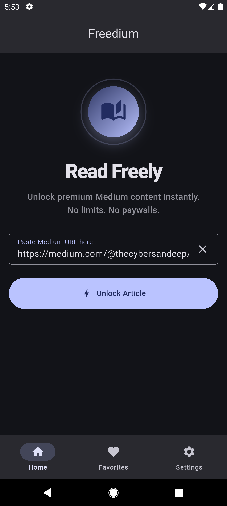
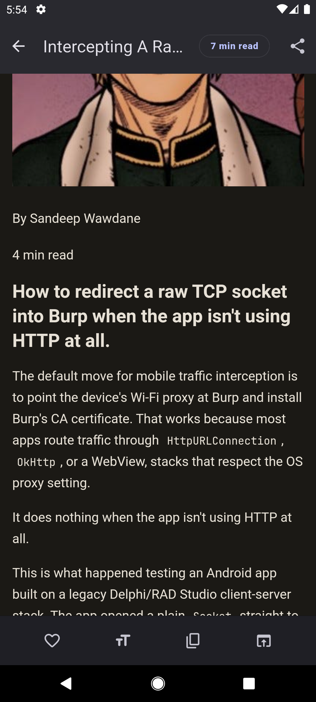
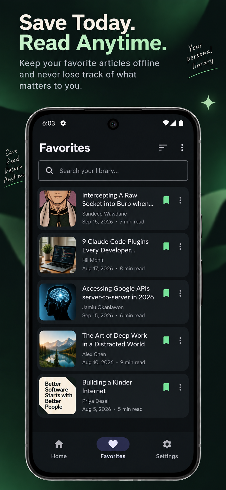
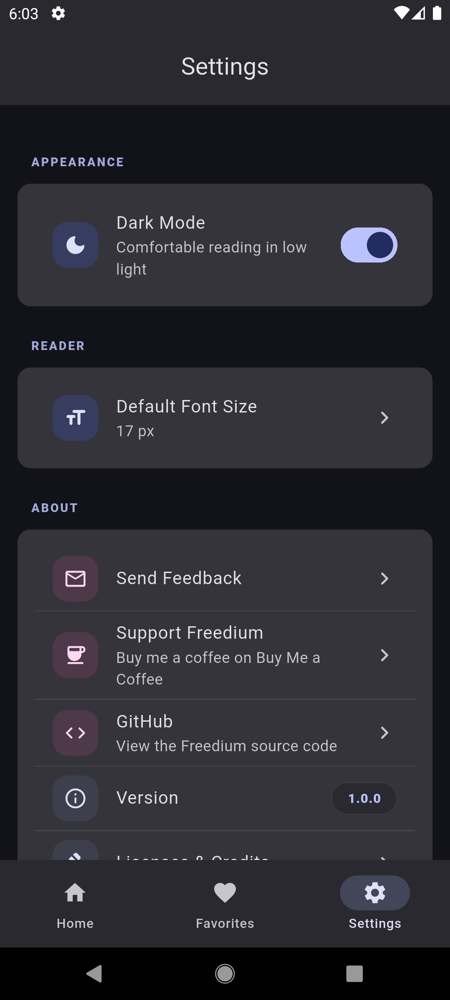

# 📖 Freedium Lite

**The friendly Medium un-paywall reader.** Paste a Medium article link, hit *Unlock*, and read the full story in a clean, distraction-free reader — no subscription, no clutter, no drama.

<p align="center">
  
  
  
  
  
</p>

> 📖 *Readora* is now **Freedium Lite** — same app, friendlier name. 🎉

---

## What is this? 🤔

Freedium Lite is a **free & open-source Flutter app** for **Android** that gives you a better way to read Medium articles. It uses the **Freedium mirror network** to serve the full article content, then wraps it in a beautifully styled, ad-free reading experience — with custom typography, dark/light themes, and none of the popover, paywall, and "you've used your free articles" nonsense.

Think of it as a cozy reading room for Medium stories. 📚

---

## ✨ Features

### 🛡️ Unlock any Medium story
Paste a link, or share one from any app, and Freedium Lite fetches the full article through the Freedium mirror. A friendly message appears if something goes wrong (offline, server hiccup, broken link) — no cryptic errors, ever.

### 🔗 Share-to-read (one tap)
Reading something on your phone? Just hit **Share → Freedium Lite** and the article opens instantly. Works with any text containing a URL.

### 🎨 A reading experience you control
- 🌙 **Dark & light themes** — dark mode by default (easy on the eyes)
- 🔠 **Font size slider** (14–28) for comfortable reading
- ✒️ **Font family picker** — Inter, Roboto, Merriweather, Open Sans
- All preferences are saved automatically

### 📊 Reading progress bar
A live progress indicator in the app bar shows exactly where you are in the article.

### 💾 Resume where you left off
Freedium Lite remembers your scroll position per article — close it, come back later, and you're right back where you stopped.

### ⭐ Offline favorites
Save articles locally — no account needed. Search by title, author, or source, swipe to remove, and re-open any favorite in one tap.

### 🖼️ Cleared landing pages
Injected CSS + a popup blocker strip away paywalls, nav bars, dialogs, menus, and modal popovers — leaving just the story.

---

## 📲 Download

| Platform | Link |
|----------|------|
| 🤖 Android APK | [Latest Release](https://github.com/birmehto/Readora/releases/latest) |
| 🍎 iOS | 🚧 Planned — watch this space! |

> **Tip:** On Android, make sure you allow installs from unknown sources for direct APK downloads.

Linux desktop scaffolding is included too, but the app is built for phones first.

---

## 🛠️ Build from source

### Prerequisites
- **Flutter** `>= 3.44.0` ([install guide](https://docs.flutter.dev/get-started/install))
- **Dart** `>= 3.13.0` (ships with Flutter)
- An Android device/emulator (or just build an APK)

### Run it

```bash
git clone https://github.com/birmehto/Readora.git
cd Readora
flutter pub get
flutter run
```

### Build a release APK

```bash
flutter build apk --release
# split per ABI (smaller files)
flutter build apk --release --split-per-abi
```

Output lands in `build/app/outputs/flutter-apk/`.

### Quality checks

```bash
flutter analyze      # static analysis
flutter test         # run the test suite
dart format .        # format the code
```

CI runs all of these on every push, plus test coverage reports via Codecov. ✅

---

## 🧭 Project structure

```
lib/
├── main.dart                      # App entry point
├── app.dart                       # Root widget + theming
├── core/
│   ├── constants/                 # Freedium URL, timeouts, reader CSS/JS
│   ├── routes/                    # Routing (GetX)
│   ├── services/                  # Storage, theme, clipboard, share intent
│   ├── utils/                     # URL validation & cleanup
│   └── widgets/                   # Shared UI (shell, error/empty states…)
└── features/
    ├── home/                      # URL input + unlock button
    ├── article/                   # WebView reader + settings sheet
    ├── favorites/                 # Local saved articles
    └── settings/                  # Appearance & about
```

Each feature follows a clean layout: `controllers/`, `bindings/`, `views/`, `widgets/`, `models/`.

---

## 🧰 Tech stack

| Piece | What it uses |
|-------|--------------|
| 🧩 Framework | Flutter (Material 3) |
| 🗂️ State & routing | GetX |
| 🌐 Reader engine | `flutter_inappwebview` |
| 💾 Local storage | `get_storage` |
| 📤 Sharing | `share_plus` + `receive_sharing_intent` |
| 🎨 UI kit | `material_3_expressive` + `material_ui` |
| 🔗 Links | `url_launcher`, `package_info_plus`, `intl` |

---

## 🤝 Contributing

Found a bug? Have an idea? PRs and issues are always welcome!

1. 🍴 **Fork** the repo
2. 🌿 Create a branch (`git checkout -b feat/my-idea`)
3. ✍️ Make your changes — keep the lints happy (`flutter analyze`)
4. 🧪 Add tests where it makes sense (`flutter test`)
5. 🚀 Open a **pull request**

Please be nice — this is a passion project, and kindness makes open source go `round. 💜`

---

## 💌 Feedback & support

Found a broken mirror? Want a feature (iOS? more mirrors?)?. Got a bug report?

- Open a [GitHub issue](https://github.com/birmehto/Readora/issues)
- Or email: birmehto@gmail.com

Enjoying Freedium Lite? **[Buy me a coffee ☕](https://buymeacoffee.com/birmehto)** — it keeps the mirrors and the momentum going!

---

## ⚖️ Legal & disclaimer

Freedium Lite is **not affiliated with, endorsed by, or connected to Medium or Freedium**. It simply wraps publicly available reader endpoints. All article content remains the property of its original authors. Please respect authors — and consider supporting the writers you love.

Open-source under the [MIT License](LICENSE). © Bir Mehto.